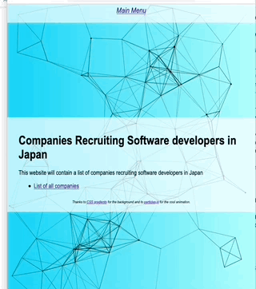

# Project goPolyglottal
This project was made during a one-week sprint at [Code Chrysalis Tokyo](www.codechrysalis.io).
The aim is to dabble into one language during one week and learn similarities and differences with Javascript (the main language taught at Code Chrysalis)

# Summary 🧑‍💼
This app uses **Go** to create a simple REST API server. The front-end pages are served using Go's template engine.
The database contains information regarding companies potentially recruiting in Tokyo. (This API was the first step towards 
creating a tool enabling users to record useful data regarding their job hunt).

# Screenshot 🖥️

Thanks to [particles.js](https://vincentgarreau.com/particles.js/) for the cool particle animation and [CSS Gradients](https://cssgradient.io/gradient-backgrounds/) for the CSS gradient.

# Installation 🤔 and how to run 🏃
## Installation
1. Clone the repo to your local machine.
1. Install `PostgreSQL` 
1. Create a Postgres database.
  1. Run `psql` utility
  1. Run `CREATE DATABASE mydatabase;` (replacing `mydatabase` by your name of choice)
1. Create a `.env` file storing variables (look at the `example.env` file if you need assistance)
1. From the terminal, go to the proper folder and run `go run main.go`
1. With a web browser, visit the page `http://localhost:8000` to see the main page! 🎉

# Next features
* Using Go's [testing package](https://golang.org/pkg/testing/) to do robust unit tests and integration tests
* Make database configuration more flexible (.env file)
* Using [Docker](https://www.docker.com) to deploy easily images of this program

# References 🙏
* [Official Golang page and API](https://golang.org)
* [Go by examples](https://gowebexamples.com/static-files/)
And for some fun,
* [Design your gopher](https://gopherize.me)

# License 👈
This repository is provided under the terms of MIT License
